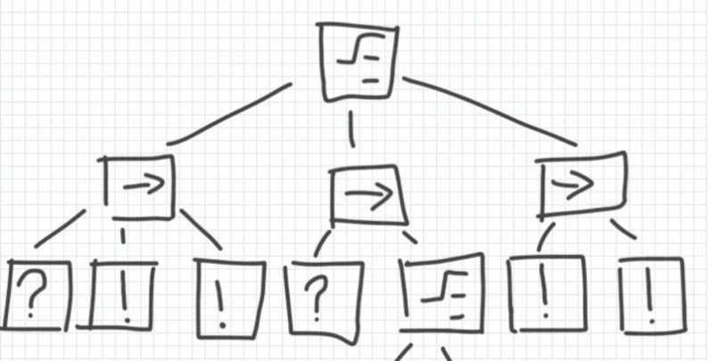

# 行为树语法基础

行为树经常用于描述任务以及任务切换方式的。它们最初是在2004/2005左右在游戏行业引
入的，最着名的是Damian Isla的Halo 2和Andrew Stern以及Michael Mateas的
Façade；两者都基于机器行为与虚拟智能代理方面的预处理。主要的动机是为了创建一种这
样的语言：
    1. 易于用图形表示和理解;
    2. 良好的执行效率
    3. 可以定向管理独立对象的因有复杂度

它们现在经常被用于在所有类型的游戏和模拟中实现NPC AI，并且自从进化了很多.

## 数据结构
 让我们先来看一下行为树常用的数据结构。像大多数人（也包括你）所猜想的，它是树结构
 更确切地说是定向的根树，一个根节点，有向边缘，没有循环。大多数时候，行为树从根节
 点开始，自顶向下表示。由于节点的子节点的顺序具有意义，它们通常是水平对齐的，最左
 边被认为是第一个孩子，最右边是最后一个。

 