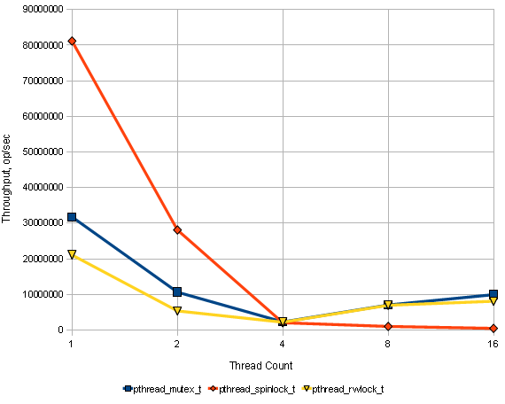
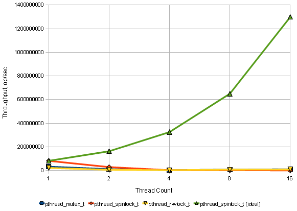

# 读写问题

原文链接： http://www.1024cores.net/home/lock-free-algorithms/reader-writer-problem
 

读写问题是并行系统中的常见的基础问题之一。在单线程环境中访问的类型（读或
者写）的不相关的。当一个线程拥有一个对象的引用时，它可以对该对象做它想要做的
任何操作（大多数情况中，你可以将读改为写而不产生任何问题）.然尔，在多线程环
境中数据的访问方式是固定的，因为多个线程可以异步的读取数据而不产生的任何冲突
（数据竞争），但是要要进行写入操作时就必须独占数据（一次最多一个线程行写操作）
。

现在有一个读写锁可以用于这个情况，那还有什么问题吗？

问题是传统的读写锁无法进行扩展。在提高读取负载时它出现了非正常的性能降级。以
下是pthread_mutex_t，pthread_spinlock_t和pthread_rwlock_t的综合基准
测试结果：

让我们为我们想要观察的内容添加一条绿线，这是pthread_spinlock_t的完美线性加
速：

对于读写锁，假设在10000个循环中处于互斥状态中尽可能的拓展读取负载是非常重要的。
当你拥有更多的硬件处理线程，那么你的处理时间也就越多。否则的话，读取线程间同步
开销（线程切换，数据同步）将会是主要开销，而且系统也无法拓展。根本原因是每一个
读取线程所指执行的读写锁的lock和unlock操作的同步协议是一个写访问（关于互斥锁的
内部数据），而写访问在同一时刻只能由一个线程执行。

而且，读取线程与写入线程互斥也是一个问题。无论是读取线程还是写入线程在高负载的情
况下都有可能饥饿，注意当你拥有越多的硬件线程时，它们也将产生越多的负载。也就是说
，这不仅仅是程序的影响，也与底层硬件相关，在你升级了性能更好的机器后，你可能会发
现程序的性能反而下降了（这在现在情况中并不少见）。

高级读写器同步原语的整体思想是使逻辑上只读访问物理上只读共享数据和/或消除读写器之
间的互斥。

对于这个，有几个这方面的技术：

## 多版本并发控